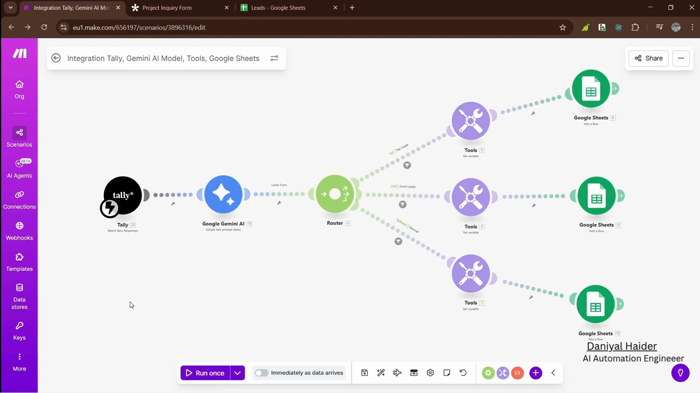

#  AI-Powered Lead Qualification System

A high-efficiency automation workflow designed to eliminate manual lead sorting. This system uses Large Language Models (LLMs) to analyze inbound project inquiries, score them based on business value, and route them to the appropriate priority queue.

## 🚀 Overview
Sorting through "junk" inquiries is a major bottleneck for sales teams. This prototype automates the analysis phase, ensuring that high-priority leads are flagged and handled instantly.

### **The Workflow:**
1. **Intake:** User submits a "Project Inquiry" via **Tally Forms**.
2. **Analysis:** **Google Gemini AI** processes the raw text (scope, budget, timeline).
3. **Qualification:** The AI assigns a **Priority Score (0-100)** and a **Category (High, Medium, Low)** based on custom business logic.
4. **Data Management:** Leads are dynamically routed and logged into **Google Sheets** for immediate action.

## 🛠️ Tech Stack
* **Automation Platform:** [Make.com](https://www.make.com/)
* **AI Model:** Google Gemini Pro
* **Trigger:** Tally Forms
* **Database:** Google Sheets
* **Logic:** Router & Tool modules within Make
## 📊 System Workflow

## 📋 Features
* **Instant Scoring:** No more waiting for manual reviews.
* **Intelligent Reasoning:** The AI provides a "Lead Type" explanation for every decision.
* **Scalable Architecture:** Can be easily extended to Slack, CRM (HubSpot/Salesforce), or automated email responses.
* **Customizable Logic:** Tailor the AI prompt to your specific "Ideal Customer Profile" (ICP).

---
*Developed as part of my AI Automation Internship. Passionate about building systems that save time and increase ROI.*
